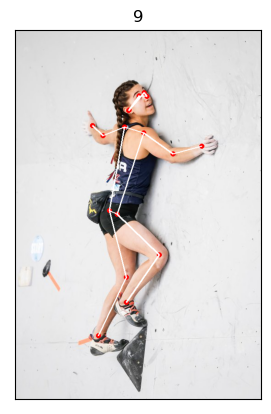

# README

In [this notebook](./climbing_pose.ipynb), we apply a pretrained Keypoint RCNN model to the task of pose estimation, specifically within the domain of single person climbing images. Within this directory is the folder [more_climbers](/more_climbers) which contains the bulk of the images that will be analyzed in the notebook. The images in the root folder were used for setting up and initially testing the model.
